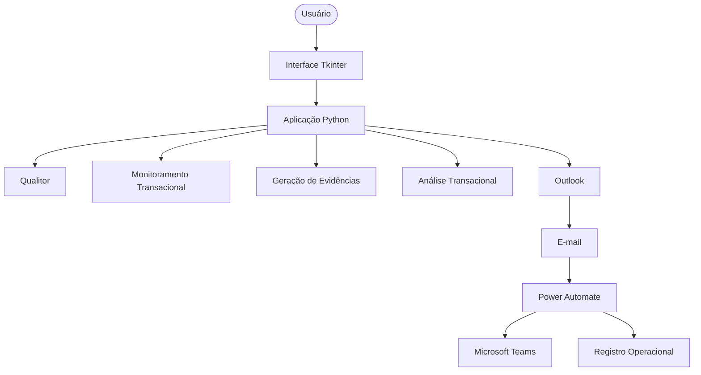
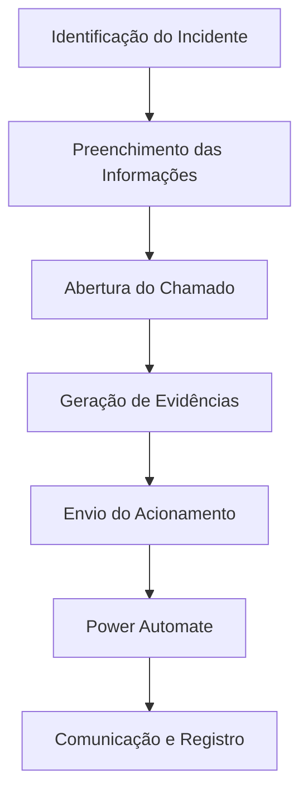
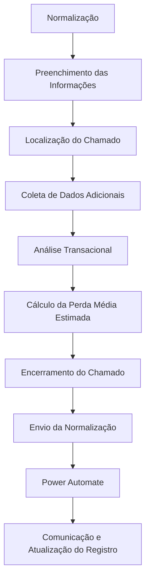

# Automação de Incidentes Transacionais

Automação desenvolvida para **reduzir o tempo de reporte e acionamento após a identificação de um incidente transacional**, padronizando e automatizando as principais etapas do processo operacional.

A solução integra **Python**, **Playwright**, **Microsoft Outlook** e **Power Automate**, automatizando desde a abertura do incidente até a comunicação de normalização.

O código público demonstra a arquitetura, a lógica e suas habilidades técnicas, sem revelar os dados, relacionamentos, acessos ou particularidades do ambiente corporativo real.

## Objetivo

Reduzir atividades manuais e o tempo necessário para comunicar e registrar incidentes transacionais.

A automação é responsável por:

- Coletar as informações do incidente;
- Abrir e encerrar chamados automaticamente;
- Gerar evidências do ambiente transacional;
- Enviar comunicações por e-mail;
- Calcular a perda média transacional estimada;
- Acionar fluxos do Power Automate;
- Publicar comunicações operacionais;
- Atualizar o registro do incidente;
- Registrar logs para acompanhamento e troubleshooting.

---

## Arquitetura

A solução utiliza uma arquitetura híbrida, na qual o Python executa o processamento principal e o Power Automate dá continuidade aos processos de registro e encerramento.



---

## Fluxos

A automação possui dois fluxos principais.

### Registro de Incidente



Durante o registro, a automação coleta informações como parceiro, tipo de transação, status, indisponibilidade e horário de início.

Também são geradas, quando disponíveis:
- Evidência da operadora;
- Detalhamento transacional;
- Gráfico transacional.

---

### Finalização de Incidente



---

## Estrutura do Projeto

```text
projeto/
│
├── backend/
│   ├── avg_transacional/
│   │   └── avg_perda.py
│   │
│   ├── email/
│   │   └── envio_email.py
│   │
│   ├── gerar_screenshots/
│   │   ├── geral_function.py
│   │   ├── screenshot_detalhado.py
│   │   ├── screenshot_op.py
│   │   └── screenshot_trans.py
│   │
│   ├── qualitor/
│   │   ├── abertura_chamado.py
│   │   └── encerra_chamado.py
│   │
│   ├── logger_config.py
│   └── path_utils.py
│
├── data/
│   ├── email_op.example.json
│   ├── info_incidente.example.json
│   └── operadoras.example.json
│
├── frontend/
│   └── screen.py
│
├── main.py
├── main.spec
├── build.bat
├── instalar_automacao.bat
├── .env.example
└── README.md
```

---

## Principais Componentes

### `main.py`
Ponto de entrada da aplicação e responsável pela orquestração dos fluxos de registro e finalização.

### `frontend/screen.py`
Interface gráfica desenvolvida com Tkinter para coleta das informações e seleção da operação.

### `backend/qualitor/`
Automatiza a abertura e o encerramento de chamados utilizando Playwright.

### `backend/gerar_screenshots/`
Responsável pela geração automática das evidências utilizadas durante o acionamento.

### `backend/avg_transacional/`
Realiza a análise histórica do período do incidente e obtém uma estimativa da perda média transacional.

### `backend/email/`
Responsável pela criação e pelo envio das comunicações através do Microsoft Outlook.

### `backend/logger_config.py`
Centraliza a configuração e o armazenamento dos logs da aplicação.

---

## Integração com Power Automate

O Power Automate complementa o processamento realizado pelo Python de forma assíncrona. A integração ocorre através do **disparo de e-mails estruturados** enviados pela aplicação Python para uma caixa de correio monitorada. 

O Power Automate possui dois fluxos principais ativos:
* **Automação Incidente - Abertura:** Disparado ao receber o e-mail de acionamento. Publica alertas nos canais do Microsoft Teams e cria o registro operacional inicial.
* **Automação Incidente - Encerramento:** Disparado ao receber o e-mail de normalização. Atualiza o painel operacional, anexa os indicadores de perda estimada e encerra o ciclo do incidente.

---

## Tecnologias Utilizadas

A automação utiliza diferentes tecnologias para integrar sistemas, automatizar tarefas operacionais e dar continuidade ao processo de gestão de incidentes.

### Python
Responsável pela lógica principal e pela orquestração dos fluxos de registro e finalização de incidentes.

### Playwright
Utilizado para automação web, permitindo a interação com o Qualitor, portais transacionais e ambientes de monitoramento.

### Tkinter
Utilizado na construção da interface gráfica para coleta das informações e seleção das operações da automação.

### Microsoft Outlook
Responsável pelo envio automatizado das comunicações de abertura e normalização dos incidentes, além de funcionar como ponto de integração com o Power Automate.

### Microsoft Power Automate
Responsável pela continuidade dos fluxos após o processamento realizado pelo Python, incluindo extração de informações, comunicação operacional e atualização dos registros.

### Microsoft Teams
Utilizado para publicação das comunicações de abertura e normalização dos incidentes.

### Microsoft Excel
Utilizado pelo Power Automate para consulta e atualização dos registros operacionais dos incidentes.

### JSON
Utilizado para armazenamento temporário do estado do incidente e para configurações externas da aplicação.

### Python Logging
Responsável pela rastreabilidade da execução, registro de eventos, erros e informações utilizadas no troubleshooting.

### PyInstaller
Utilizado para empacotar a aplicação Python e seus recursos em um executável para ambiente Windows.

## Stack da Solução

```text
                    AUTOMAÇÃO
                        │
              ┌─────────┴─────────┐
              │                   │
        Aplicação Python     Power Automate
              │                   │
        ┌─────┼─────┐         ┌───┼───┐
        │     │     │         │       │
    Tkinter Playwright Outlook Teams  Excel
              │
              ▼
       Sistemas Corporativos
